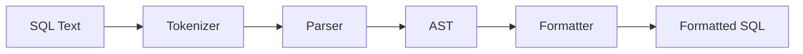

# sqlfmt

[](https://www.npmjs.com/package/@vcoppola/sqlfmt)
[](https://www.npmjs.com/package/@vcoppola/sqlfmt)
[](https://github.com/vinsidious/sqlfmt/blob/main/LICENSE)
[](https://github.com/vinsidious/sqlfmt/actions)

An opinionated, zero-config SQL formatter that implements [river alignment](https://www.sqlstyle.guide/) — right-aligning keywords so content flows along a consistent vertical column. No `.sqlfmtrc`, no `--init`, no style toggles.

## Quick Start

### Install

```bash
npm install @vcoppola/sqlfmt
```

### CLI Usage

```bash
# Format a file
npx sqlfmt query.sql

# Format all SQL files
npx sqlfmt "**/*.sql"

# Check formatting (CI mode)
npx sqlfmt --check "**/*.sql"

# Format in place
npx sqlfmt --write "**/*.sql"
```

### Programmatic Usage

```typescript
import { formatSQL } from '@vcoppola/sqlfmt';

const formatted = formatSQL('select id, name from users where active = true;');
// Output:
// SELECT id, name
//   FROM users
//  WHERE active = TRUE;
```

## Table of Contents

- [What it does](#what-it-does)
- [When NOT to use sqlfmt](#when-not-to-use-sqlfmt)
- [SQL Dialect Support](#sql-dialect-support)
- [CLI Reference](#cli-reference)
- [API Guide](#api-guide)
- [How the formatter works](#how-the-formatter-works)
- [Edge Cases & Behavior](#edge-cases--behavior)
- [FAQ](#faq)
- [Documentation](#documentation)
- [Development](#development)
- [Performance](#performance)
- [Limitations](#limitations)
- [License](#license)

## What it does

Takes messy SQL and formats it with **river alignment** — right-aligning keywords so content flows along a consistent vertical column:

```sql
-- Input
select e.name, e.salary, d.department_name from employees as e inner join departments as d on e.department_id = d.department_id where e.salary > 50000 and d.department_name in ('Sales', 'Engineering') order by e.salary desc;

-- Output
SELECT e.name, e.salary, d.department_name
  FROM employees AS e
       INNER JOIN departments AS d
       ON e.department_id = d.department_id
 WHERE e.salary > 50000
   AND d.department_name IN ('Sales', 'Engineering')
 ORDER BY e.salary DESC;
```

### More examples

**Multi-table JOINs:**

```sql
-- Input
select o.id, c.name, p.title, o.total from orders o join customers c on o.customer_id = c.id left join products p on o.product_id = p.id left join shipping s on o.id = s.order_id where o.created_at > '2024-01-01' and s.status = 'delivered' order by o.created_at desc;

-- Output
SELECT o.id, c.name, p.title, o.total
  FROM orders AS o
  JOIN customers AS c
    ON o.customer_id = c.id

       LEFT JOIN products AS p
       ON o.product_id = p.id

       LEFT JOIN shipping AS s
       ON o.id = s.order_id
 WHERE o.created_at > '2024-01-01'
   AND s.status = 'delivered'
 ORDER BY o.created_at DESC;
```

**CTEs (Common Table Expressions):**

```sql
-- Input
with monthly_totals as (select date_trunc('month', created_at) as month, sum(amount) as total from payments group by 1), running as (select month, total, sum(total) over (order by month) as cumulative from monthly_totals) select * from running where cumulative > 10000;

-- Output
  WITH monthly_totals AS (
           SELECT DATE_TRUNC('month', created_at) AS month,
                  SUM(amount) AS total
             FROM payments
            GROUP BY 1
       ),
       running AS (
           SELECT month, total, SUM(total) OVER (ORDER BY month) AS cumulative
             FROM monthly_totals
       )
SELECT *
  FROM running
 WHERE cumulative > 10000;
```

**Window functions:**

```sql
-- Input
select department, employee, salary, rank() over (partition by department order by salary desc) as dept_rank, salary - avg(salary) over (partition by department) as diff_from_avg from employees;

-- Output
SELECT department,
       employee,
       salary,
       RANK() OVER (PARTITION BY department
                        ORDER BY salary DESC) AS dept_rank,
       salary - AVG(salary) OVER (PARTITION BY department) AS diff_from_avg
  FROM employees;
```

**CASE expressions:**

```sql
-- Input
select name, case status when 'A' then 'Active' when 'I' then 'Inactive' when 'P' then 'Pending' else 'Unknown' end as status_label, case when balance > 10000 then 'high' when balance > 1000 then 'medium' else 'low' end as tier from accounts;

-- Output
SELECT name,
       CASE status
       WHEN 'A' THEN 'Active'
       WHEN 'I' THEN 'Inactive'
       WHEN 'P' THEN 'Pending'
       ELSE 'Unknown'
       END AS status_label,
       CASE
       WHEN balance > 10000 THEN 'high'
       WHEN balance > 1000 THEN 'medium'
       ELSE 'low'
       END AS tier
  FROM accounts;
```

## When NOT to use sqlfmt

- **You need configurable styles** — sqlfmt is zero-config by design. If you need adjustable indentation, keyword casing options, or line-width limits, use [sql-formatter](https://github.com/sql-formatter-org/sql-formatter) or [prettier-plugin-sql](https://github.com/JounQin/prettier-plugin-sql).
- **You exclusively target MySQL or SQL Server** — sqlfmt is PostgreSQL-first. Standard ANSI SQL works fine, but vendor-specific syntax (stored procedures, MySQL-only functions) may not be fully parsed.
- **You need a language server** — sqlfmt is a formatter, not a linter or LSP. It does not provide diagnostics, completions, or semantic analysis.

## SQL Dialect Support

### PostgreSQL (Full Support)

- Type casts (`::integer`), JSON operators (`->`, `->>`), dollar-quoting (`$$...$$`)
- Array constructors, window functions, CTEs, LATERAL joins
- ON CONFLICT (UPSERT), RETURNING clauses
- **Note:** PL/pgSQL function bodies are preserved verbatim (not reformatted)

### ANSI SQL (Full Support)

- SELECT, INSERT, UPDATE, DELETE, MERGE
- JOINs (INNER, LEFT, RIGHT, FULL, CROSS, NATURAL)
- CTEs (WITH, WITH RECURSIVE)
- Window functions (PARTITION BY, ORDER BY, frame clauses)
- DDL (CREATE TABLE, ALTER TABLE, DROP, CREATE INDEX, CREATE VIEW)

### MySQL (Partial)

- Standard ANSI SQL queries format correctly
- Backtick identifiers, LIMIT offset syntax, and storage engine clauses are not yet supported

### SQL Server (Partial)

- Standard ANSI SQL queries format correctly
- T-SQL procedural syntax (BEGIN/END blocks, DECLARE, @@variables) is not yet supported

### Recovery Mode

Unsupported syntax is passed through unchanged rather than causing errors. Use `--strict` to fail on unparseable SQL.

## Style Guide

This formatter is inspired by and makes every attempt to conform to the [Simon Holywell SQL Style Guide](https://www.sqlstyle.guide/). Key principles from the guide that `sqlfmt` enforces:

- **River alignment** — Clause/logical keywords are right-aligned to a per-statement river width derived from the longest top-level aligned keyword
- **Keyword uppercasing** — Reserved words like `SELECT`, `FROM`, `WHERE` are uppercased
- **Identifier normalization** — Most unquoted identifiers are lowercased; quoted identifiers are preserved
- **Right-aligned clause/logical keywords** — `SELECT`, `FROM`, `WHERE`, `AND`, `OR`, `JOIN`, `ON`, `ORDER BY`, `GROUP BY`, etc. align within each formatted block
- **Consistent indentation** — Continuation lines and subexpressions are indented predictably

For the full style guide, see [sqlstyle.guide](https://www.sqlstyle.guide/) or the [source on GitHub](https://github.com/treffynnon/sqlstyle.guide).

## Why sqlfmt?

| | **sqlfmt** | sql-formatter | prettier-plugin-sql |
|---|---|---|---|
| **Formatting style** | River alignment ([sqlstyle.guide](https://www.sqlstyle.guide/)) | Indentation-based | Indentation-based |
| **Configuration** | Zero-config, opinionated | Configurable | Configurable via Prettier |
| **PostgreSQL support** | First-class (casts, JSON ops, dollar-quoting, arrays) | Partial | Partial |
| **Runtime dependencies** | Zero | Several | Prettier + parser |
| **Idempotent** | Yes | Yes | Yes |
| **Keyword casing** | Uppercase (enforced) | Configurable | Configurable |
| **Identifier casing** | Lowercase (enforced) | Not modified | Not modified |
| **Output** | Deterministic, single style | Depends on config | Depends on config |

sqlfmt is the right choice when you want a formatter that produces consistent, readable SQL without any configuration decisions -- just run it and move on.

### Zero-config philosophy

`sqlfmt` does not support `.sqlfmtrc`, `--init`, or style customization flags. This is deliberate: one deterministic style, the same output everywhere, no formatter tuning overhead.

## CLI Reference

```bash
# Format a file (prints to stdout by default)
npx @vcoppola/sqlfmt query.sql

# Format a file in place
npx @vcoppola/sqlfmt --write query.sql

# Format from stdin
cat query.sql | npx @vcoppola/sqlfmt

# Check if a file is already formatted (exits non-zero if not)
npx @vcoppola/sqlfmt --check query.sql

# List files that would change (useful in CI)
npx @vcoppola/sqlfmt --list-different "src/**/*.sql"
npx @vcoppola/sqlfmt -l "migrations/*.sql"

# Strict mode: fail on unparseable SQL instead of passing through
npx @vcoppola/sqlfmt --strict --check "**/*.sql"

# Ignore files (can repeat --ignore)
npx @vcoppola/sqlfmt --check --ignore "migrations/**" "**/*.sql"

# Or store ignore patterns in .sqlfmtignore (one pattern per line)
npx @vcoppola/sqlfmt --check "**/*.sql"

# Control color in CI/logs
npx @vcoppola/sqlfmt --color=always --check query.sql

# Pipe patterns
pbpaste | npx @vcoppola/sqlfmt | pbcopy          # Format clipboard (macOS)
pg_dump mydb --schema-only | npx @vcoppola/sqlfmt > schema.sql
echo "select 1" | npx @vcoppola/sqlfmt
```

By default, `npx @vcoppola/sqlfmt query.sql` prints formatted output to **stdout**. Use `--write` to modify the file in place.

When present, `.sqlfmtignore` is read from the current working directory and combined with any `--ignore` flags.

**CLI exit codes:**

| Code | Meaning |
|------|---------|
| `0` | Success (or all files already formatted with `--check`) |
| `1` | Check failure, usage error, or I/O error |
| `2` | Parse or tokenize error |

## API Guide

### Basic Usage

```typescript
import { formatSQL } from '@vcoppola/sqlfmt';

const formatted = formatSQL('SELECT * FROM users;');
```

### Error Recovery

By default, unparseable SQL is passed through unchanged:

```typescript
const warnings: string[] = [];
const formatted = formatSQL(sql, {
  onRecover: (error, raw) => {
    warnings.push(`Line ${error.token.line}: ${error.message}`);
  }
});
```

### Strict Mode (throw on parse errors)

```typescript
import { formatSQL, ParseError } from '@vcoppola/sqlfmt';

try {
  formatSQL(sql, { recover: false });
} catch (err) {
  if (err instanceof ParseError) {
    console.error(`Parse error: ${err.message}`);
  }
}
```

### Depth Limits

```typescript
formatSQL(sql, { maxDepth: 300 }); // Increase for deeply nested CTEs
```

### Input Size Limits

```typescript
formatSQL(sql, { maxInputSize: 5_000_000 }); // 5MB limit (default: 10MB)
```

### Low-Level Access

```typescript
import { tokenize, parse, formatStatements } from '@vcoppola/sqlfmt';

// Tokenize SQL into a token stream
const tokens = tokenize(sql);

// Parse SQL into an AST
const ast = parse(sql);

// Format AST nodes back to SQL
const output = formatStatements(ast);
```

### Error Types

```typescript
import { formatSQL, TokenizeError, ParseError, MaxDepthError } from '@vcoppola/sqlfmt';

try {
  const result = formatSQL(input);
} catch (err) {
  if (err instanceof TokenizeError) {
    // Invalid token encountered during lexing (e.g., unterminated string)
    console.error(`Tokenize error at position ${err.position}: ${err.message}`);
  } else if (err instanceof MaxDepthError) {
    // Parser nesting exceeded configured maxDepth
    console.error(`Parse depth exceeded: ${err.message}`);
  } else if (err instanceof ParseError) {
    // Structural error in the SQL (e.g., unmatched parentheses)
    console.error(`Parse error: ${err.message}`);
  } else if (err instanceof Error && err.message.includes('Input exceeds maximum size')) {
    // Input exceeded maxInputSize
    console.error(`Input too large: ${err.message}`);
  } else {
    throw err;
  }
}
```

## How the formatter works



1. **Tokenizer** (`src/tokenizer.ts`) — Splits SQL text into tokens (keywords, identifiers, literals, operators, comments)
2. **Parser** (`src/parser.ts`) — Builds an AST from the token stream
3. **Formatter** (`src/formatter.ts`) — Walks the AST and produces formatted output

The key formatting concept is the **river**. For each statement, `sqlfmt` derives a river width from the longest top-level aligned keyword in that statement (for example, `RETURNING` can widen DML alignment). Clause/logical keywords are then right-aligned to that width so content starts in a consistent column. Nested blocks may use their own derived widths. This approach comes directly from the [Simon Holywell SQL Style Guide](https://www.sqlstyle.guide/).

## Edge Cases & Behavior

### Long Lines

sqlfmt targets 80-column output but does not break individual tokens (identifiers, string literals). Lines may exceed 80 columns when single tokens are long.

### Comment Preservation

Line comments and block comments are preserved. Comments attached to specific expressions maintain their association.

### Keyword Casing

All SQL keywords are uppercased. Identifiers are preserved as-is (quoted identifiers keep their case and quotes). Unquoted identifiers are lowercased.

### Idempotency

Formatting is idempotent: `formatSQL(formatSQL(x)) === formatSQL(x)` for all valid inputs.

## FAQ

**Q: Can I change the indentation style or keyword casing?**
A: No. sqlfmt is zero-config by design, like Prettier. One style, everywhere.

**Q: What happens with SQL syntax sqlfmt doesn't understand?**
A: In default (recovery) mode, unrecognized statements are passed through unchanged. Use `--strict` to fail instead.

**Q: How fast is sqlfmt?**
A: ~5,000 statements/second on modern hardware. A typical migration file formats in <10ms.

**Q: Does sqlfmt modify SQL semantics?**
A: No. sqlfmt only changes whitespace and keyword casing. The semantic meaning is preserved.

**Q: Does sqlfmt respect `.editorconfig`?**
A: No. sqlfmt is zero-config — it does not read `.editorconfig`, `.sqlfmtrc`, or any configuration file. The output style is always the same.

**Q: Can I customize the river width?**
A: No. The river width is automatically derived per statement from the longest top-level aligned keyword. This ensures consistent formatting without any manual tuning.

**Q: Does formatting change SQL semantics?**
A: sqlfmt only changes whitespace and casing. Specifically: SQL keywords are uppercased (`select` becomes `SELECT`), unquoted identifiers are lowercased (`MyTable` becomes `mytable`), and quoted identifiers are preserved exactly (`"MyTable"` stays `"MyTable"`). If your database is case-sensitive for unquoted identifiers (rare, but possible), see the [Migration Guide](docs/migration-guide.md) for details.

**Q: Does sqlfmt work with MySQL / SQL Server / SQLite?**
A: sqlfmt is PostgreSQL-first, but any query written in standard ANSI SQL will format correctly regardless of your target database. Vendor-specific extensions (stored procedures, MySQL-only syntax) may not be fully parsed. See [SQL Dialect Support](#sql-dialect-support) for details.

## Documentation

- [Integrations](docs/integrations.md) -- Pre-commit hooks, CI pipelines, and editor setup recipes
- [Architecture](docs/architecture.md) -- Internal pipeline and design decisions
- [Style Guide Mapping](docs/style-guide.md) -- How sqlfmt maps to each rule in the Simon Holywell SQL Style Guide
- [Migration Guide](docs/migration-guide.md) -- Rolling out sqlfmt in existing codebases with minimal churn
- [Contributing](CONTRIBUTING.md) -- Development setup, running tests, and submitting changes
- [Changelog](CHANGELOG.md) -- Release history

## Development

Requires [Bun](https://bun.sh/).

```bash
# Install dependencies
bun install

# Run tests
bun test

# Type check
bun run check

# Build dist (for npm publishing)
bun run build
```

## Performance

sqlfmt has zero runtime dependencies and formats SQL through a single tokenize-parse-format pass. Typical throughput is 5,000+ statements per second on modern hardware. Input is bounded by default size limits to prevent excessive memory use on untrusted input.

## Limitations

- Dialect coverage is broad but intentionally pragmatic, with strongest support for PostgreSQL-style syntax.
- Procedural SQL bodies (`CREATE FUNCTION ... LANGUAGE plpgsql` control-flow blocks, vendor-specific scripting extensions) are not fully parsed as procedural ASTs.
- Unknown/unsupported constructs may fall back to raw statement preservation.
- Formatting style is opinionated and focused on a Holywell-style output rather than per-project style configurability.

## License

MIT
